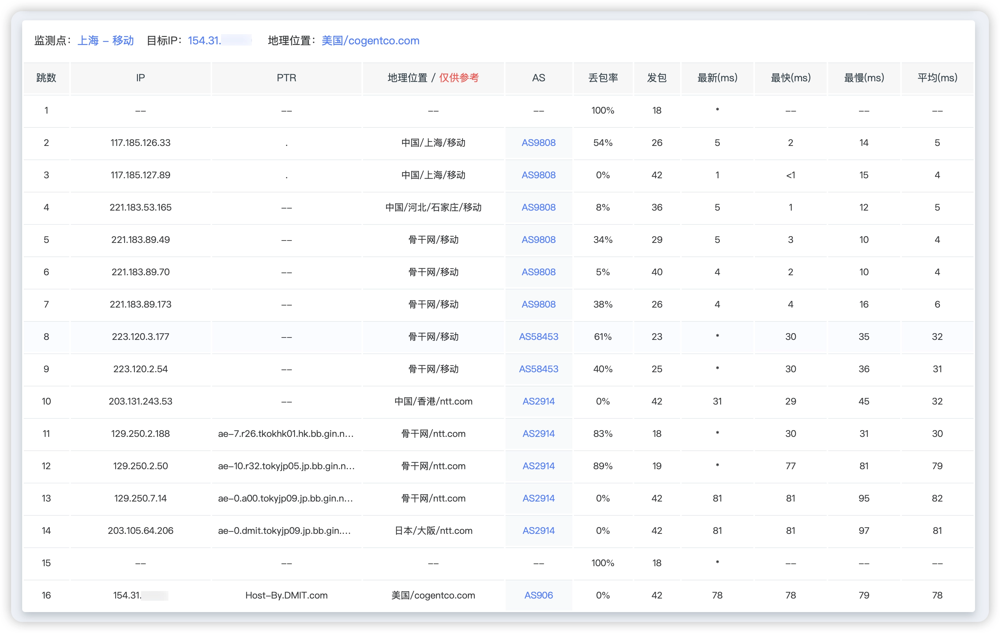
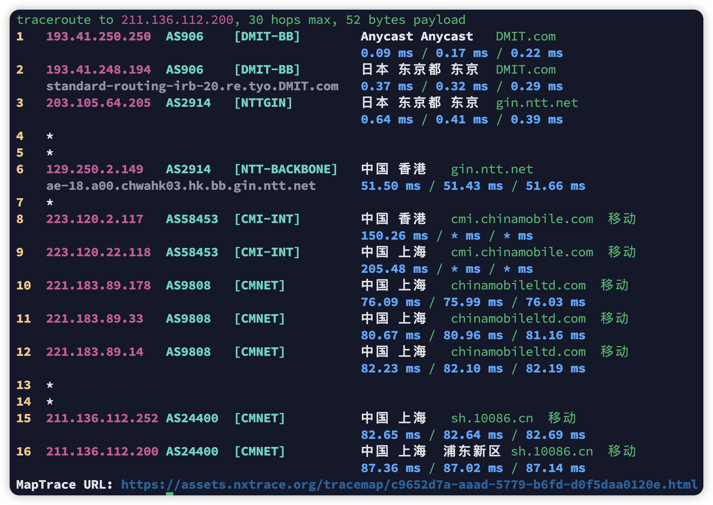
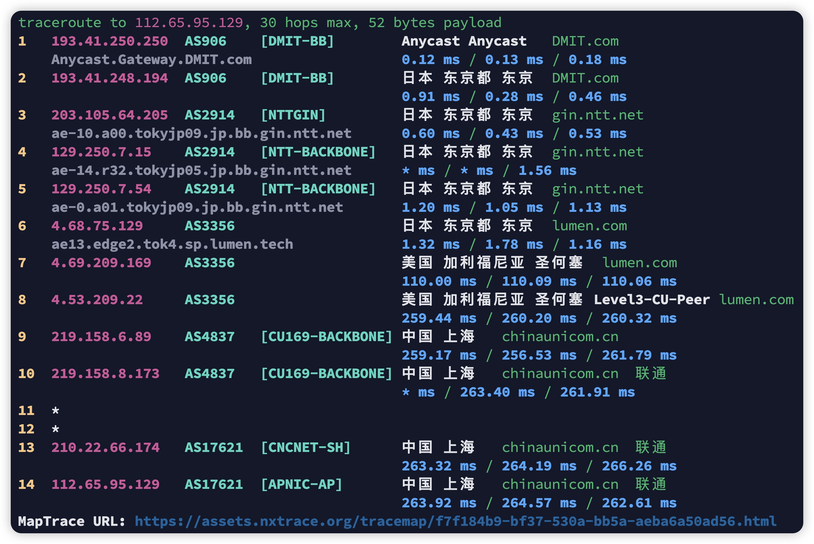
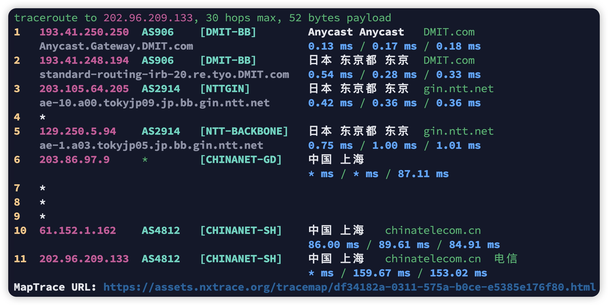
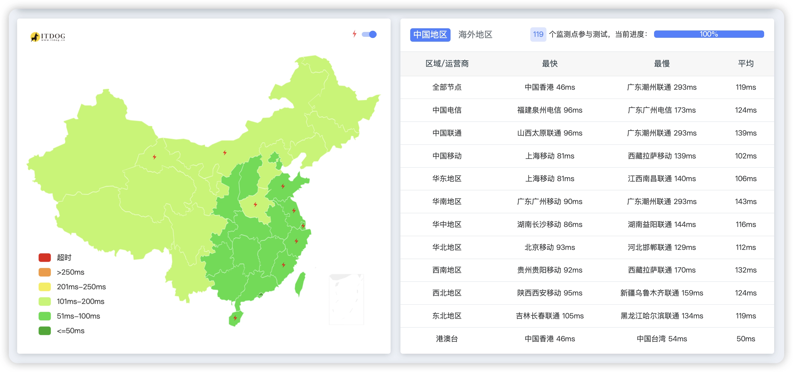

# DMIT 2024 Christmas Sale: TYO Tier1 Series Launch and Performance Review

Looking for reliable Japan VPS hosting without breaking the bank? DMIT's 2024 Christmas promotion introduces their new TYO Tier1 product line alongside discounts on premium CN2 GIA routes. With AMD EPYC processors, 10Gbps bandwidth, and competitive pricing starting at $128.77/year (after discount), these servers offer solid performance for international deployment and mobile network users.

---

## Christmas 2024 Featured Plans

DMIT's holiday lineup includes three standout options across different network tiers:

**LAX.Pro.PalmSpring (Los Angeles CN2 GIA)**
- 2 vCPU / 2 GB RAM / 40GB SSD
- 2000GB monthly traffic @ 2Gbps bandwidth
- Return: Triple-network CN2 GIA
- Outbound: CT CN2 GIA, CU Telia, CM CMI
- Price: $100 USD/year
- [Purchase Link](https://www.dmit.io/aff.php?aff=13832)

**TYO.Pro.Shinagawa (Japan CN2 GIA)**
- Eligible for buy-two-get-one promotion
- 1 vCPU / 2.0 GB RAM / 60GB SSD
- 500GB monthly traffic @ 500Mbps bandwidth
- Route: Premium Japan CN2 GIA
- Price: $199.99 USD/year
- [Purchase Link](https://www.dmit.io/aff.php?aff=13832)

**TYO.EB.WEE (Japan CMI)**
- 1 vCPU / 1.0 GB RAM / 20GB SSD
- 450GB monthly traffic @ 500Mbps bandwidth
- Route: Japan CMI
- Price: $154.9 USD/year
- [Purchase Link](https://www.dmit.io/aff.php?aff=13832)

For complete details, visit the official promotion page at the top of their website.

## Introducing TYO Tier1: International Performance Meets Value

DMIT just rolled out their TYO Tier1 series—a new product line designed for international connectivity without mainland China optimization. Traffic calculation is unidirectional, making it ideal for landing nodes or China Mobile users (routes via Hong Kong).

**TYO.T1.MINI Specifications:**
- 2 vCPU
- 2.0 GB RAM
- 60GB SSD Storage
- 10 Gbps port speed
- 8000GB monthly transfer
- 1 IPv4 & 1 IPv6 /64
- ~~$262.80~~ **$183.96 USD/year** (30% off)
- Promo code: **T1-CHRISTMAS-2024-ANNUALLY-30OFF**
- [Purchase Link](https://www.dmit.io/aff.php?aff=13832)

If you're building a multi-region infrastructure or need reliable Japan-based hosting with generous bandwidth allocations, the TYO Tier1 lineup delivers exceptional value. The 10Gbps port and 8TB monthly transfer provide plenty of headroom for bandwidth-intensive applications.

👉 [Explore DMIT's full range of global hosting solutions with premium network routes](https://www.dmit.io/aff.php?aff=13832)

---

## TYO Tier1 Performance Testing

Here's what the hardware and network performance looks like in real-world testing:

### System Benchmark

**Hardware Overview:**
- CPU: AMD EPYC 7443P 24-Core @ 2.84GHz
- RAM: 960.7 MB
- Storage: 20.6 GB SSD
- I/O Speed: 803 MB/s average
- Virtualization: KVM
- OS: Debian GNU/Linux 12

The AMD EPYC 7443P delivers solid single-core performance with Geekbench 5 scoring 1344 for single-core and 1284 for multi-core workloads. Storage I/O consistently hits 800+ MB/s—more than adequate for typical VPS workloads.

### Network Performance

**Global Speedtest Results:**
- Tokyo local: 4058 Mbps down / 4264 Mbps up (0.25ms latency)
- Singapore: 2378 Mbps down / 1027 Mbps up
- Los Angeles: 2312 Mbps down / 809 Mbps up
- Hong Kong: 42 Mbps down / 838 Mbps up

The server absolutely flies on local and regional connections. International speeds remain strong, though mainland China connectivity shows typical international route characteristics (no optimization).

### Streaming & Service Compatibility

**IPv4 Test Results:**
- YouTube Premium: ✓ Yes (Region: JP)
- Amazon Prime Video: ✓ Yes (Region: JP)
- Netflix: Originals Only
- Disney+: ✗ IP Banned
- ChatGPT: Web Browser Only
- Steam Currency: JPY

Japanese streaming services like U-NEXT, Lemino, FOD, and Radiko work perfectly. Some services show restrictions, which is typical for international VPS hosting.

### Network Routes to Mainland China

**China Mobile:**
Routes through NTT backbone → Hong Kong CMI → mainland destinations. Latency to Beijing/Shanghai/Shenzhen ranges from 80-95ms—respectable for international routes.

**China Unicom:**
Takes NTT → Lumen (Level3) → CU169 backbone path. West coast US transit adds latency (250-340ms), making this less optimal for Unicom users.

**China Telecom:**
Uses NTT backbone with direct peering. Shanghai routes show 85-150ms latency, while Shenzhen connections see 115ms—solid performance for international routing.

### Ping Test Summary

Average latencies from major Chinese cities:
- Mobile users: 80-95ms
- Telecom users: 105-150ms  
- Unicom users: 270-340ms

Mobile network users get the best experience, while Unicom connections route suboptimally through US transit.

---

## Conclusion

DMIT's Christmas 2024 sale brings compelling options whether you need premium CN2 GIA connectivity or cost-effective international hosting. The new TYO Tier1 series hits a sweet spot for users who don't require mainland China optimization but want reliable Japan-based infrastructure with generous bandwidth.

For China Mobile users or international deployments, TYO Tier1 offers excellent value with 10Gbps ports, 8TB monthly transfer, and AMD EPYC processors—all at $128.77/year after the 30% discount. The hardware performs solidly, network speeds impress, and Japanese IP resources work well for regional services.

If you're building distributed infrastructure or need a reliable Japan presence, this promotion is worth considering. 👉 [Check out DMIT's complete hosting lineup with premium network connectivity](https://www.dmit.io/aff.php?aff=13832)
